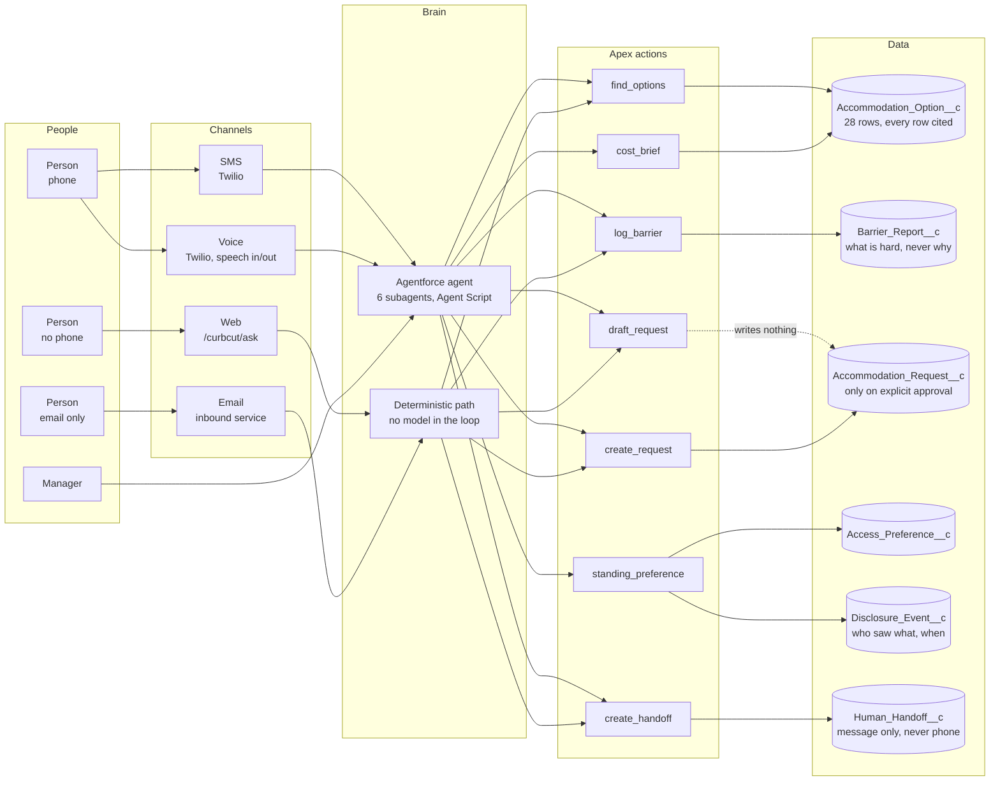
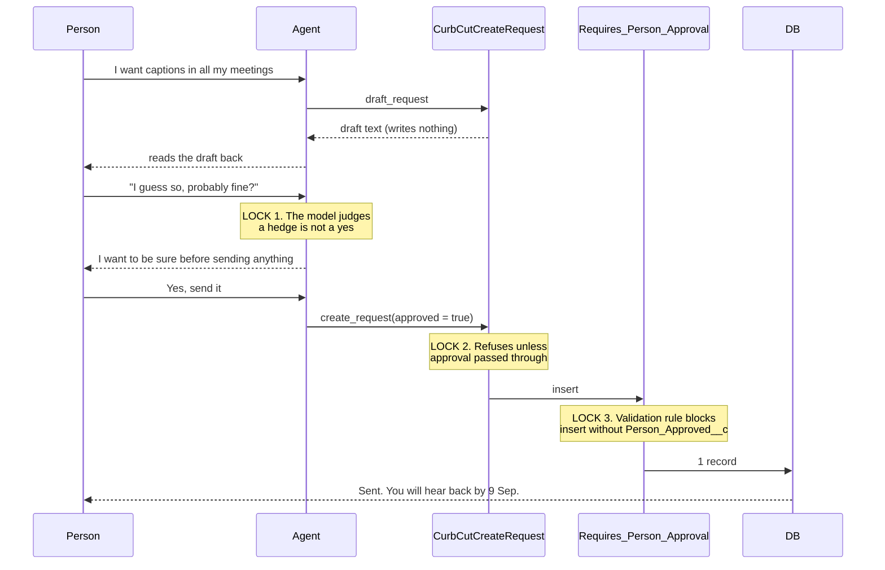
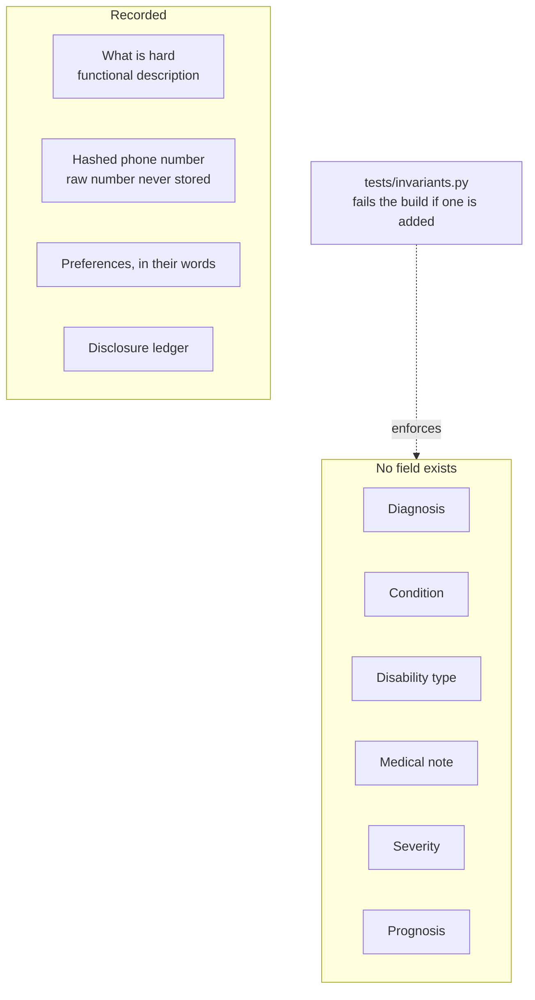

# Architecture

## The shape of it

**The web and email channels deliberately bypass the model.** They call exactly
the same Apex actions the agent calls, in the same order, against the same
library. For the highest-stakes step, creating a request. There is nothing to
hallucinate, and the approval gate is code rather than judgement. Someone on a
library computer gets the *safest* version of the system, not the flakiest.

## The approval gate

The claim the whole project rests on. Three independent locks:

Verified against the database, not the prose: **exactly one record, created on
the genuine yes and not on the hedge**, reproducible across runs.

## The absence

A manager who asks is refused. Not because the agent is discreet, but because
there is nothing to tell them.

## Platform constraints, honestly

Established by querying the org, not assumed:

| Capability | State | Consequence |
|---|---|---|
| `Network`, `ExperienceBundle`, `DigitalExperienceConfig` | **not available** | Experience Cloud and LWR cannot exist here. Force.com Sites + Visualforce is the only public-site mechanism. |
| `LightningComponentBundle` | available | LWC is the upgrade path if Digital Experiences is ever licensed. |
| `EmailServicesFunction` | available | email channel built. |
| `CustomSite`, `ApexPage`, `StaticResource` | available | the site as it stands. |
| Slack metadata | **none** | Slack cannot be built in this org. Roadmap only. |
| Tableau | essentially absent | roadmap only. |
| Data Cloud types | present, licensing unverified | roadmap only. |

Visualforce was not a preference. It was the only mechanism available.

## Guest-user security

The site guest user is the most exposed identity in the system.

- Holds **read and create only**. The platform maximum for a guest, and enforced by a CI invariant.
- Holds **no View All** on anything.
- Has **no access at all** to `Access_Profile__c` or `Disclosure_Event__c`, it can never see anything about a person.
- Reads the public library through a narrow `without sharing` class that touches one object containing no personal information, with field-level security still enforced.
